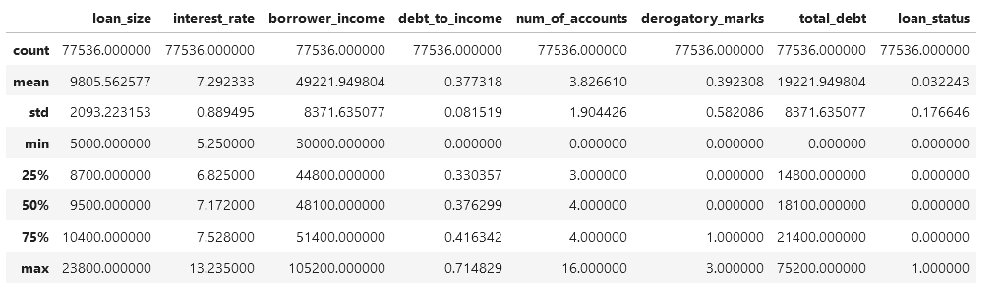

# Supervised Learning - Credit Risk Classification

## Overview of the Analysis
* This reposity examines lending data.  A key column seems to be loan_status.  Machine learning examines data and learns patterns in the data.  This can help explain why some loans are in good standing while others are not.
* Explain what financial information the data was on, and what you needed to predict - there are different types of columns, from loan size (characteristics of a loan), borrow income information, and credit items, such as derogatory marks.  The categories of data cover important factors that do impact loan status.

* Provide basic information about the variables you were trying to predict (e.g., `value_counts`).
  

* Describe the stages of the machine learning process you went through as part of this analysis.
- Load data
- We did not clean the data, such as dealing with nulls.
- Data analysis (description of data)
- Split into training and testing
- Create a model
- Create logistic regression model base on the training and testing data
-  Examine actual versus predicted results using Confusion Matrix and Classification Report
-  Analysis of model
  
* Briefly touch on any methods you used (e.g., `LogisticRegression`, or any other algorithms).
- A Linear regression model was used to fit the model to the data (learn)
- Confustion Matrix showed the actual versus predicted, specifically to get true/false positives/negatives
- Classification Report was used to provide more detail, such as precision and sensitivity.

## Results

Using bulleted lists, describe the accuracy scores and the precision and recall scores of all machine learning models.

* Machine Learning Model 1:
    * Description of Model 1 Accuracy, Precision, and Recall scores.

## Summary

Summarize the results of the machine learning models, and include a recommendation on the model to use, if any. For example:
The Linear Regression Model does a good job at predicting loan status.  This model should be used to determine if an individual should receive a loan or not, and also the interest rate (high for high risk for defaul, lower for those individuals with lower risk of defaul).

* Which one seems to perform best? How do you know it performs best?
* Does performance depend on the problem we are trying to solve? (For example, is it more important to predict the `1`'s, or predict the `0`'s? )
  Yes.  Healthcare models, such as studying the results of a new drug, requires precise understanding and very strict results.  Business models are usually not as strict, although this might not be the case in some instances.  Financial requlations might require very precise modeling, meaning detailed results from the Classification Report.

If you do not recommend any of the models, please justify your reasoning.

